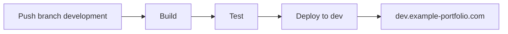

# CI/CD Pipeline

## Ambientes

### Development (Desenvolvimento)

- **Branch**: `development`
- **URL**: `dev.example-portfolio.com`
- **Porta**: `3001`
- **Recursos**:
  - CPU Limit: 0.5
  - Memory Limit: 256M
  - CPU Reserve: 0.25
  - Memory Reserve: 128M

### Release (Homologação)

- **Branch**: `main`
- **URL**: `release.example-portfolio.com`
- **Porta**: `3002`
- **Recursos**:
  - CPU Limit: 0.75
  - Memory Limit: 384M
  - CPU Reserve: 0.5
  - Memory Reserve: 256M

### Production (Produção)

- **Trigger**: Tags `v[0-9]+.[0-9]+.[0-9]+`
- **URL**: `example-portfolio.com`
- **Porta**: `3000`
- **Recursos**:
  - CPU Limit: 1.0
  - Memory Limit: 512M
  - CPU Reserve: 0.75
  - Memory Reserve: 384M

## Fluxo de Deploy

### 1. Development

1. Push para branch `development`
2. Build da aplicação
3. Download do build do Nexus
4. Build da imagem Docker
5. Push para registry com tag `development`
6. Deploy no ambiente de desenvolvimento

### 2. Release

1. Push para branch `main`
2. Build da aplicação
3. Download do build do Nexus
4. Build da imagem Docker
5. Push para registry com tag `release`
6. Deploy no ambiente de homologação

### 3. Production

1. Push de tag com padrão `v*.*.*`
2. Build da aplicação
3. Download do build do Nexus
4. Build da imagem Docker
5. Push para registry com tags `latest` e versão
6. Deploy no ambiente de produção

## Secrets

### Development

- `DEV_DOMAIN`: URL do ambiente de desenvolvimento
- `NEXUS_CREDENTIALS`: Credenciais do Nexus
- `REGISTRY_CREDENTIALS`: Credenciais do registry

### Release

- `RELEASE_DOMAIN`: URL do ambiente de homologação
- `NEXUS_CREDENTIALS`: Credenciais do Nexus
- `REGISTRY_CREDENTIALS`: Credenciais do registry

### Production

- `PRODUCTION_DOMAIN`: URL do ambiente de produção
- `NEXUS_CREDENTIALS`: Credenciais do Nexus
- `REGISTRY_CREDENTIALS`: Credenciais do registry

## Notas Importantes

1. **Segurança**:
   - Nunca commite secrets no repositório
   - Use GitHub Secrets para armazenar informações sensíveis
   - Configure as variáveis de ambiente no pipeline

2. **Versionamento**:
   - Development: SHA do commit (7 caracteres)
   - Release: `rc-{SHA do commit}`
   - Production: Tag semântica `v*.*.*`

3. **Zero Downtime**:
   - Todos os deploys são feitos com rolling update
   - Imagens são baixadas antes do deploy
   - Healthcheck é executado antes de finalizar o deploy

4. **Recursos**:
   - Cada ambiente tem recursos específicos
   - Monitoramento de recursos via Docker
   - Alertas configurados para uso de recursos

5. **Rollback**:
   - Possível via redeploy de versão anterior
   - Imagens mantidas no registry
   - Tags preservadas para referência
