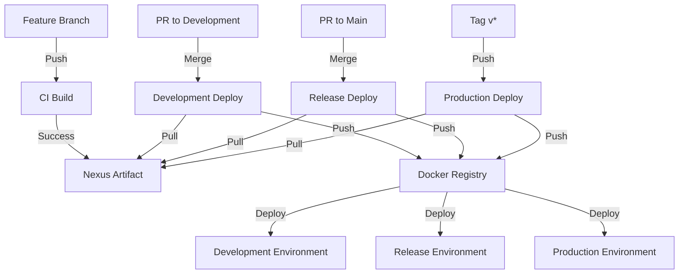

# CI/CD Pipeline

This document describes the CI/CD rules and workflow for the project.

## Execution Rules

### Continuous Integration (CI)

CI should be executed in the following situations:

1. **Feature Branch Pushes:**
   - `feat/*`
   - `fix/*`
   - `docs/*`
   - `style/*`
   - `refactor/*`
   - `test/*`
   - `chore/*`

2. **Pull Requests:**
   - From feature branches to `development`
   - From `development` to `main`

### Continuous Deployment (CD)

CD is divided into three environments:

1. **Development Environment:**
   - Triggered when feature branch PRs are merged to `development`
   - Uses CI-generated artifact
   - Docker image tag: `development`

2. **Release Environment:**
   - Triggered when `development` PR is merged to `main`
   - Uses CI-generated artifact
   - Docker image tag: `release`

3. **Production Environment:**
   - Triggered when a `v*` tag is pushed to `main`
   - Uses Nexus artifact from release
   - Docker image tags: `latest` and specific version

### When NOT to Execute CI/CD

CI/CD should not be executed in these cases:

1. Direct pushes to main branches:
   - `main` (blocked)
   - `development` (blocked)

2. Commits in already open PRs (CI already executed)

3. Changes only in non-code files:
   - `.md`
   - `.txt`
   - `.gitignore`
   - etc.

4. PRs with status:
   - Closed
   - Draft
   - Not following naming convention

## Artifact Flow

1. **CI Build:**
   - Generates application artifact
   - Uploads to Nexus Repository

2. **CD Development/Release:**
   - Downloads CI artifact from Nexus
   - Builds Docker image
   - Publishes to Registry
   - Deploys to environment

3. **CD Production:**
   - Downloads release artifact from Nexus
   - Builds Docker image
   - Publishes to Registry
   - Deploys to production

## Pipeline Flow

## Environment Variables

### Required Secrets

- `NEXUS_USERNAME`: Nexus user
- `NEXUS_PASSWORD`: Nexus password
- `NEXUS_URL`: Nexus Repository URL
- `NEXUS_REPOSITORY`: Nexus repository name
- `REGISTRY_URL`: Docker Registry URL

## Manual Deployment

All environments support manual deployment through GitHub Actions `workflow_dispatch`, allowing version specification for deployment.

## Troubleshooting

### Common Issues

1. **CI Build Failure**
   - Verify test failures in GitHub Actions logs
   - Check if all dependencies are installed
   - Ensure environment variables are set

2. **Deployment Issues**
   - Check if Nexus artifact exists
   - Verify Docker Registry connectivity
   - Validate environment variables
   - Check container logs

3. **Environment Access**
   - Development: <https://dev.example.com>
   - Release: <https://release.example.com>
   - Production: <https://example.com>

### Support

For deployment issues:

1. Check GitHub Actions logs
2. Verify Nexus Repository
3. Contact your DevOps team
