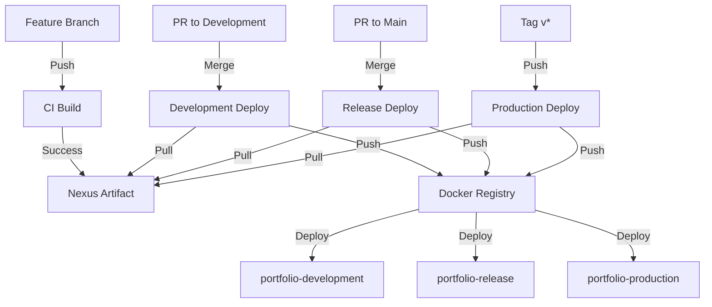

# CI/CD Pipeline

This document describes the CI/CD rules and workflow for the project.

## Execution Rules

### Continuous Integration (CI)

CI should be executed in the following situations:

1. **Feature Branch Pushes:**
   - `feat/*`
   - `fix/*`
   - `docs/*`
   - `style/*`
   - `refactor/*`
   - `test/*`
   - `chore/*`

2. **Pull Requests:**
   - From feature branches to `development`
   - From `development` to `main`

### Continuous Deployment (CD)

CD is divided into three environments:

1. **Development Environment:**
   - Triggered when feature branch PRs are merged to `development`
   - Uses CI-generated artifact
   - Docker image tag: `development`
   - Port: 3001
   - Resources:
     - CPU Limit: 0.5
     - Memory Limit: 256M
     - CPU Reserve: 0.25
     - Memory Reserve: 128M

2. **Release Environment:**
   - Triggered when `development` PR is merged to `main`
   - Uses CI-generated artifact
   - Docker image tag: `release`
   - Port: 3002
   - Resources:
     - CPU Limit: 0.75
     - Memory Limit: 384M
     - CPU Reserve: 0.5
     - Memory Reserve: 256M

3. **Production Environment:**
   - Triggered when a `v*` tag is pushed to `main`
   - Uses Nexus artifact from release
   - Docker image tags: `latest` and specific version
   - Port: 3000
   - Resources:
     - CPU Limit: 1
     - Memory Limit: 512M
     - CPU Reserve: 0.75
     - Memory Reserve: 384M

### When NOT to Execute CI/CD

CI/CD should not be executed in these cases:

1. Direct pushes to main branches:
   - `main` (blocked)
   - `development` (blocked)

2. Commits in already open PRs (CI already executed)

3. Changes only in non-code files:
   - `.md`
   - `.txt`
   - `.gitignore`
   - etc.

4. PRs with status:
   - Closed
   - Draft
   - Not following naming convention

## Docker Compose Architecture

The project uses a unified Docker Compose architecture where all environments are defined in a single `docker-compose.yml` file:

1. **Service Names:**
   - `portfolio-development`
   - `portfolio-release`
   - `portfolio-production`

2. **Network:**
   - All services share the same network `portfolio-net`
   - Bridge driver for local deployment

3. **Environment Variables:**
   Each environment has its own prefixed variables:
   - Development: `DEV_*`
   - Release: `RELEASE_*`
   - Production: `PROD_*`

4. **Container Naming:**
   - Development: `rumbler-portfolio-development-{version}`
   - Release: `rumbler-portfolio-release-{version}`
   - Production: `rumbler-portfolio-production-{version}`

## Artifact Flow

1. **CI Build:**
   - Generates application artifact
   - Uploads to Nexus Repository with environment-specific paths:
     - `/development/{version}.zip`
     - `/release/rc-{version}.zip`
     - `/production/v{version}.zip`

2. **CD Development:**
   - Downloads CI artifact from `/development/{version}.zip`
   - Builds Docker image
   - Tags as `development` and `{version}`
   - Deploys to `portfolio-development` service

3. **CD Release:**
   - Downloads CI artifact from `/release/rc-{version}.zip`
   - Builds Docker image
   - Tags as `release` and `rc-{version}`
   - Deploys to `portfolio-release` service

4. **CD Production:**
   - Downloads release artifact from `/production/v{version}.zip`
   - Builds Docker image
   - Tags as `latest` and `v{version}`
   - Deploys to `portfolio-production` service

## Pipeline Flow

## Environment Variables

### Required Secrets

- `NEXUS_USERNAME`: Nexus user
- `NEXUS_PASSWORD`: Nexus password
- `NEXUS_URL`: Nexus Repository URL
- `NEXUS_REPOSITORY`: Nexus repository name
- `REGISTRY_URL`: Docker Registry URL

### Environment-Specific Variables

1. **Development:**
   - `DEV_PORT`: 3001
   - `DEV_CPU_LIMIT`: 0.5
   - `DEV_MEMORY_LIMIT`: 256M
   - `DEV_CPU_RESERVE`: 0.25
   - `DEV_MEMORY_RESERVE`: 128M
   - `DEV_IMAGE_TAG`: {version}

2. **Release:**
   - `RELEASE_PORT`: 3002
   - `RELEASE_CPU_LIMIT`: 0.75
   - `RELEASE_MEMORY_LIMIT`: 384M
   - `RELEASE_CPU_RESERVE`: 0.5
   - `RELEASE_MEMORY_RESERVE`: 256M
   - `RELEASE_IMAGE_TAG`: rc-{version}

3. **Production:**
   - `PROD_PORT`: 3000
   - `PROD_CPU_LIMIT`: 1
   - `PROD_MEMORY_LIMIT`: 512M
   - `PROD_CPU_RESERVE`: 0.75
   - `PROD_MEMORY_RESERVE`: 384M
   - `PROD_IMAGE_TAG`: v{version}

## Manual Deployment

All environments support manual deployment through GitHub Actions `workflow_dispatch`, allowing version specification for deployment.

## Troubleshooting

### Common Issues

1. **CI Build Failure**
   - Verify test failures in GitHub Actions logs
   - Check if all dependencies are installed
   - Ensure environment variables are set

2. **Deployment Issues**
   - Check if Nexus artifact exists
   - Verify Docker Registry connectivity
   - Validate environment variables
   - Check container logs

3. **Environment Access**
   - Development: Port 3001
   - Release: Port 3002
   - Production: Port 3000

### Support

For deployment issues:

1. Check GitHub Actions logs
2. Verify Nexus Repository
3. Contact your DevOps team
